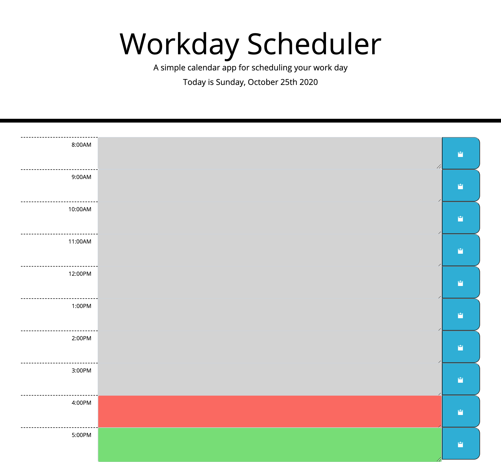

# WORKDAY SCHEDULER
This calendar application helps users manage time more efficiently by allowing them to save events for each hour of the day. The calendar features time blocks for standard business hours that are color-coded to indicate whether the time block is in the past (gray), present (red), or future (green). Click on a time block's text area to input your task. Then click on the blue "save" button for that time block, and the saved task will persist until you delete your text and resave the time block. This app is best run in a browser on your desktop and feature dynamically updated HTML and CSS powered by jQuery.

## Deployment
Workday Scheduler is published at https://kristinmoon.github.io/workday-scheduler/.

## Author
Written by <a href="https://kristinmoon.github.io/portfolio">Kristin Moon</a>
